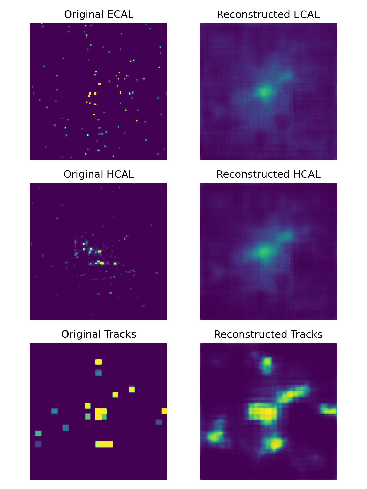
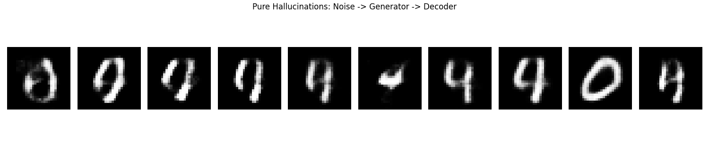
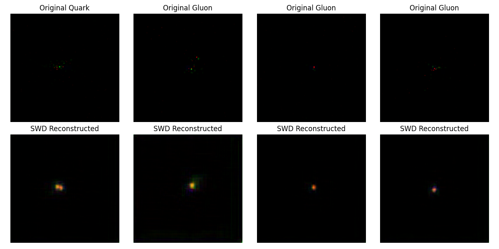
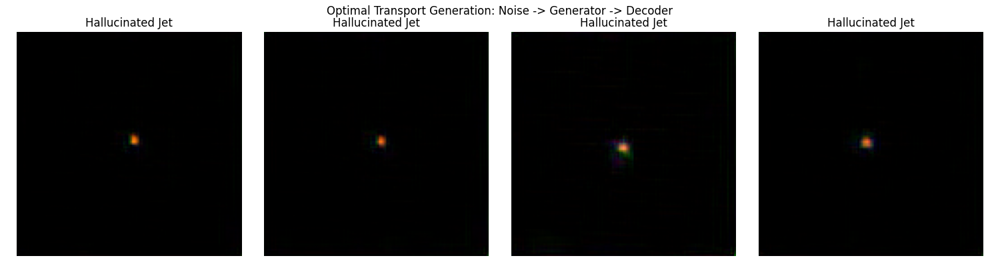

# DeepFALCON: Optimal Transport in High Energy Physics
**Google Summer of Code 2026 Evaluation - ML4Sci**
**Applicant:** Nirdesh Bhandari

## Overview
This repository contains my solutions for the ML4Sci DeepFALCON evaluation tasks. The goal of this project is to apply deep learning and generative modeling to particle physics data. 

My academic background is in Game Theory and Mechanism Design. This heavily influenced my approach to the Specific Task. I framed the generative modeling problem as an Optimal Transport task. I used the Sliced Wasserstein Distance (SWD) to calculate the "cost" of moving probability distributions, similar to finding equilibrium in minimax games.

## Dataset Preparation
All tasks use the Quark/Gluon jet dataset. The data consists of 3-channel images (ECAL, HCAL, and Tracks) at 125x125 resolution. 
* **Subset:** To allow for rapid prototyping and iteration, I evaluated the models on a limit of `1000` events. 
* **Physics Normalization:** High Energy Physics (HEP) data is highly sparse. To prevent gradients from exploding due to extreme energy spikes, I applied a global logarithmic transformation: `log(1 + energy)`.

---

## Common Task 1: Variational Autoencoder (VAE)
I trained a Convolutional Variational Autoencoder to learn a compressed representation of the quark/gluon events.

* **Architecture:** Convolutional layers for the encoder and transposed convolutions for the decoder.
* **Latent Dimension:** 32
* **Results:** The model successfully learned the macro-structure of the energy deposits. The final training loss was `0.0422` after 9 epochs. 

---

## Common Task 2: Jets as Graphs (Classification)
Particle jets are mostly empty space. Treating them as dense images wastes computation. I converted the images into graph-based point clouds to classify quarks vs. gluons.

* **Graph Construction:** I extracted the non-zero pixels. I used K-Nearest Neighbors (KNN) to connect nodes based on their physical (x,y) coordinates. Node features include spatial coordinates and log-normalized energy intensities.
* **Model:** I used PyTorch Geometric with `SAGEConv` layers for spatial message passing. I also concatenated global max pooling and global mean pooling to capture both energy spikes and radiation patterns.
* **Results:** The model trained for 15 epochs. 
    * **Best Validation AUC:** `0.7255` (Achieved at Epoch 14)
    * **Final Test ROC AUC:** `0.7443`

---

## Specific Task 4: Optimal Transport for HEP
This is the core task for my target project. Standard VAEs use KL Divergence, which struggles with non-overlapping distributions. Instead, I used the **Sliced Wasserstein Distance (SWD)** to regularize the latent space.

### Phase 1 & 2: The MNIST Baseline
Before touching the physics data, I proved the Optimal Transport mathematics on the MNIST dataset (Digits 0 and 4). 
* **Autoencoder:** I trained a basic CNN autoencoder with an SWD bottleneck. 
    * Final Recon Loss: `0.0219`
    * Final SWD Loss: `0.0950`
* **Latent Generator:** I froze the Autoencoder. I then trained a Multi-Layer Perceptron (MLP) Generator to map pure Gaussian noise into the learned latent space. 
    * Final Generator SWD Loss: `0.0924`

*(Above: The Generator successfully hallucinating entirely new digits from pure noise)*

### Phase 3: Physics Implementation (Quarks & Gluons)
I applied the exact same Optimal Transport mathematics to the 3-channel 125x125 jet images. I updated the architecture to use explicit `nn.Upsample` to handle the awkward dimensions.

* **Latent Dimension:** 128
* **Hyperparameters:** I used `MSELoss(reduction='sum')` to penalize missing the sparse energy core, and balanced it with an `SWD_WEIGHT` of 10.0.
* **Results:** * **Autoencoder Final Loss (15 Epochs):** Recon: `0.1566` | SWD: `0.3173`
    * **Generator Final Loss (10 Epochs):** SWD: `0.1771`

#### SWD Reconstructions
The Autoencoder learned to accurately reconstruct the physical center-of-mass of the energy deposits.

#### Pure Physics Generation (The Bonus Task)
By feeding pure noise into the trained Generator, the network successfully calculated the Optimal Transport map. It hallucinated entirely new, physically plausible particle jets.

---
### Conclusion & Future Work
The pipeline is now mathematically sound and free of data leakage or mode collapse. The next step during the GSoC period would be scaling this architecture to the full dataset of millions of events and further optimizing the transport maps for faster detector simulation. 
I would like to thank the mentors for providing this task. I learned a lot and enjoyed myself working on this project.